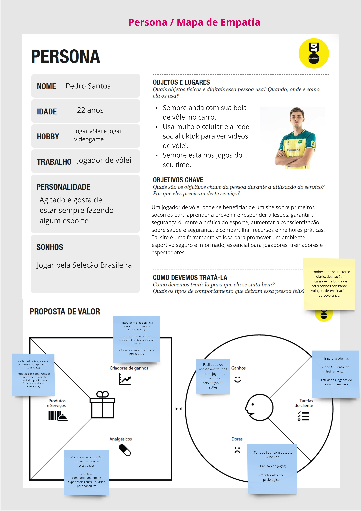
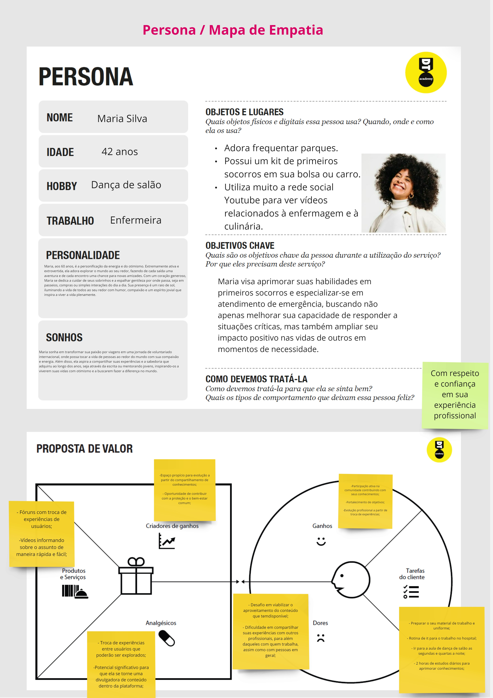
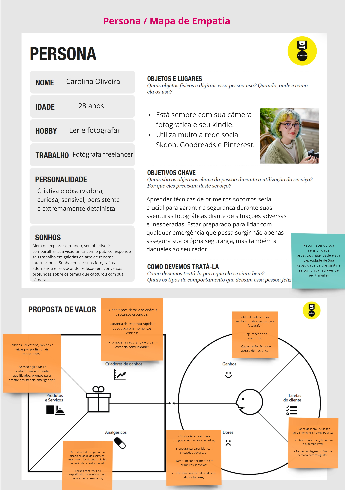
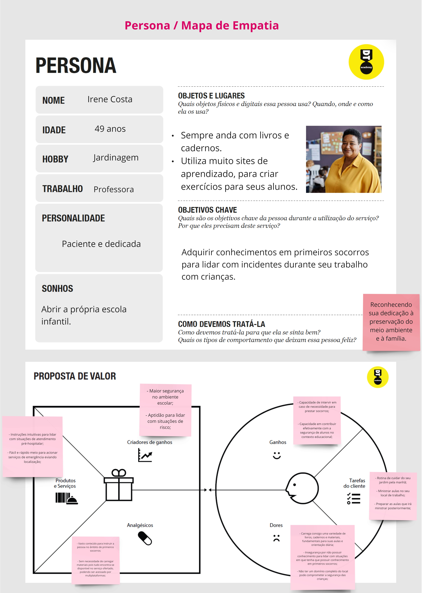
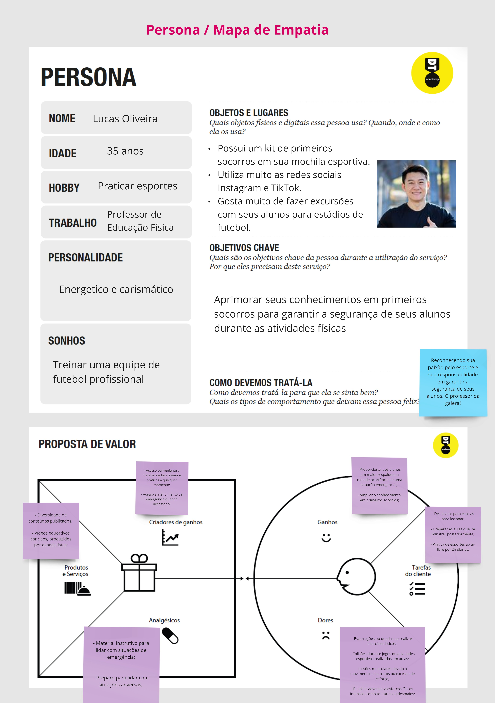
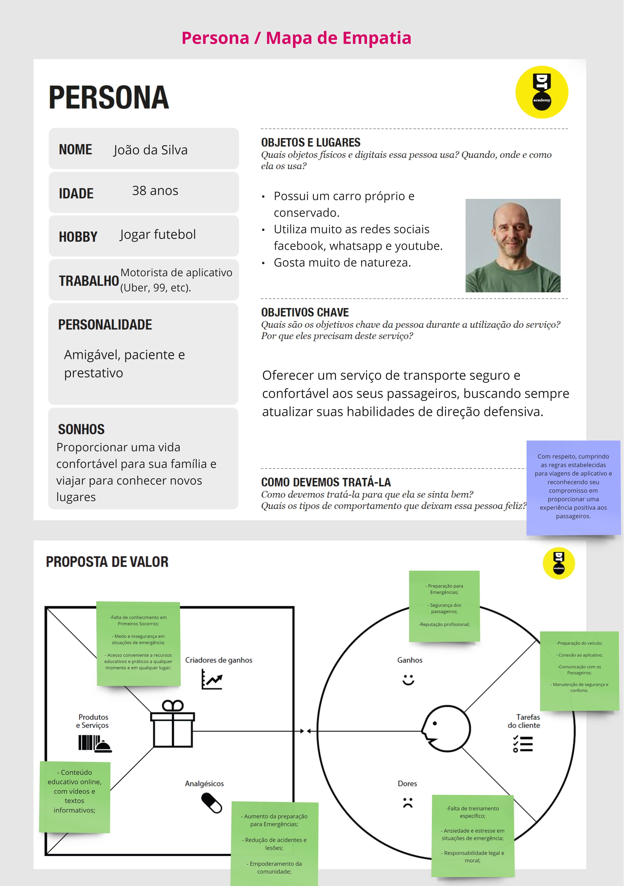

# Orientações gerais

Esta seção traz explicações breves sobre o conjunto de artefatos incluídos na documentação do projeto.

## Problema

Os primeiros socorros desempenham um papel crucial na gestão de uma ampla gama de emergências, e a falta de conhecimento sobre esse tema representa uma preocupação significativa para a segurança e o bem-estar de todos. Especialmente para pessoas acima de 13 anos que não possuem familiaridade com o assunto e precisam de orientação em situações de emergência. Tendo em vista que a capacidade de fornecer assistência imediata pode ser decisiva em situações de acidentes ou emergências médicas, é importante destacar que a prestação de primeiros socorros deve ser realizada apenas por pessoas devidamente treinadas.

Segundo Fioruc, et al. em um estudo divulgado pela revista eletrônica da UFG, que avaliou quatro escolas de ensino fundamental em São Paulo no ano de 2006, revelou brechas significativas no conhecimento dos docentes e funcionários em relação ao tema. Antes do treinamento, apenas 27,75% dos voluntários demonstraram um bom conhecimento para lidar com situações simples. Em casos mais graves, 61,43% dos participantes não saberiam agir corretamente.

De acordo com a matéria "Primeiros socorros: como agir em situações de emergência na indústria?", publicada pelo SESI e baseada nos dados do Observatório Digital de Saúde e Segurança do Trabalho do Ministério Público do Trabalho, o Brasil enfrenta um desafio alarmante em relação aos acidentes de trabalho. Com um intervalo médio de apenas 48 segundos entre cada acidente, mais de 335 milhões de pessoas foram afastadas de seus postos de trabalho devido a incidentes entre os anos de 2012 e 2018. Especificamente na indústria, entre os anos de 2015 e 2017, ocorreram cerca de 1,1 milhão de acidentes, representando a maior parte do total de 1,7 milhão de casos registrados no país durante o mesmo período, conforme relatado pelo Anuário Estatístico da Previdência Social.

A ausência de educação formal sobre o assunto, aliada ao receio de cometer erros e à indisponibilidade de treinamento acessível destacada pelos dados apresentados, reafirma-se como uma realidade persistente ao longo dos anos. Isso evidencia que muitos indivíduos possuem conhecimento limitado ou nulo sobre como agir adequadamente em situações de emergência. Essa lacuna ressalta a necessidade de educar o público e aumentar a conscientização sobre a importância dos princípios básicos de primeiros socorros.

## Objetivos

Objetivo Geral:
- Desenvolver um software dedicado à conscientização e educação em primeiros socorros visando mitigar a falta de conhecimento existente no conhecimento básico sobre como agir diante de situações de emergência. Este software será uma ferramenta fundamental para capacitar as pessoas, fornecendo-lhes informações vitais e orientações passo a passo sobre como responder a uma variedade de cenários de emergência. Ao promover uma compreensão mais profunda dos procedimentos de primeiros socorros, o software não apenas aumentará a confiança das pessoas em suas habilidades de resposta, mas também poderá salvar vidas em momentos críticos. Ele proporcionará uma experiência de aprendizado envolvente e prática, adaptada para diversos públicos, desde jovens até adultos. Além disso, a acessibilidade será priorizada, garantindo que o software seja democrático. 

Objetivos Específicos:
- Criar uma plataforma acessível e de fácil utilização que forneça informações sobre primeiros socorros de forma clara e objetiva.
- Desenvolver recursos interativos, como vídeos explicativos e simulações de situações de emergência, para melhorar o aprendizado e retenção do conhecimento.

## Justificativa

A urgência de resolver esta questão reside no fato de que muitas pessoas carecem de conhecimentos fundamentais em primeiros socorros, o que pode desencadear consequências graves durante emergências. O desenvolvimento deste software visa preencher essa lacuna, democratizando o acesso a informações essenciais sobre primeiros socorros. A opção por recursos interativos é motivada pela necessidade de engajar os usuários e facilitar a absorção do conteúdo. A utilização de questionários, entrevistas e análises estatísticas nos permitirá entender de forma mais aprofundada as necessidades e deficiências de conhecimento do público-alvo, orientando assim o desenvolvimento da solução.

## Público-Alvo

O software é direcionado a um público diversificado, compreendendo uma ampla faixa etária, a partir de 13 anos, abrangendo desde leigos até profissionais da área da saúde. Os perfis de usuários incluem:

- Leigos: Pessoas sem conhecimento prévio em primeiros socorros.
- Pais e responsáveis: Indivíduos interessados em aprender a lidar com emergências que envolvam crianças.
- Profissionais da saúde: Médicos, enfermeiros e socorristas que desejam atualizar ou reforçar seus conhecimentos.
- Educadores: Professores e instrutores que buscam recursos para ensinar ou prestar primeiros socorros em escolas e organizações.

## Personas

## Histórias de Usuários

- Como usuário, eu preciso abrir o site e ter facilidade de visualização das seções de
primeiros socorros adequados ao tipo de situação emergencial para que eu possa
encontrar rapidamente a informação necessária para prestar o socorro para um
terceiro ou para mim mesmo.

- Como usuário, eu preciso abrir o site e conseguir contatar facilmente ajuda de
terceiros, que podem variar de acordo com a minha emergência, sendo necessário
conseguir optar pelo contato adequado (bombeiros, polícia ou hospitais), para que eu
não podendo prestar o socorro inicial consiga acessar de forma rápida os profissionais
que poderão.

- Como usuário, eu preciso encontrar no site um botão de chamada de emergência que me
conecte diretamente ao serviço de atendimento médico de emergência (SAMU), permitindo
que eu chame rapidamente uma ambulância e receba orientações de profissionais qualificados
em casos de urgência médica grave.

- Como usuário, ao acessar o site, desejo encontrar um mapa interativo que me mostre a 
 localização e a disponibilidade dos postos de atendimento médico mais próximos, como 
 hospitais, clínicas e unidades de pronto-atendimento, para que eu possa identificar 
 facilmente onde obter assistência médica em caso de emergência ou necessidade de cuidados
 médicos urgentes.

 - Como usuário, desejo encontrar um mapa interativo mostrando a localização dos centros de treinamento de 
primeiros socorros mais próximos da minha região, para que eu possa participar de cursos e treinamentos
para adquirir habilidades de resgate e atendimento em situações de emergência.

- Como usuário, gostaria de ter acesso a vídeos curtos e diretos ensinando manobras de
primeiros socorros, como a de engasgamento, para que eu possa agir rapidamente em
situações de emergência sem dificuldade.

- Como usuário, preciso de uma barra de tarefas com palavras-chave de rápido acesso para
encontrar rapidamente informações específicas sobre primeiros socorros, como "engasgamento",
"ressuscitação cardiopulmonar" ou "ferimentos", para que eu possa obter as orientações necessárias
rapidamente em situações de emergência.

- Como usuário, gostaria de uma aba no site dedicada à divulgação de experiências dos usuários, onde as 
pessoas podem compartilhar como o site os ajudou em situações de emergência, oferecendo dicas e relatos
reais para incentivar outros a buscar conhecimento sobre primeiros socorros.

## Requisitos

Requisitos Funcionais (RF):

- O sistema deve disponibilizar o local de cadastro e de compartilhamento de experiências do usuários.
- O sistema deve disponibilizar conteúdo educacional sobre primeiros socorros, dividido em seções temáticas.
- O sistema deve disponibilizar recursos interativos, como vídeos explicativos e seção de mitos e verdades.
- O sistema deve disponibilizar mapa interativo dos locais de treinamento e serviços de emergência.
- O sistema deve disponibilizar uma barra de pesquisa como acesso rápido para o tipo de problema que usuário estará buscando.
- O sistema deve disponibilizar um botão que irá facilitar a comunicação do usuário com um profissional capacitado em práticas de primeiros socorros.

Requisitos Não Funcionais (RNF):

- O sistema deve possuir uma interface de usuário intuitiva e de fácil navegação.
- O sistema deve oferecer disponibilidade da plataforma para dispositivos móveis e desktop.
- O sistema deve garantir um tempo de resposta rápido para o acesso ao conteúdo.
- O sistema deve garantir a segurança dos dados dos usuários.

## User Flow

## Wireframes

- Link para o protótipo: 
 [Figma](https://www.figma.com/proto/98bjco2iTtVQWATczqWRV5/PrimeiraAjuda.com?type=design&node-id=20-11&t=6kVjYAaPRMkqMo56-1&scaling=min-zoom&page-id=20%3A2&starting-point-node-id=20%3A11&mode=design)

## Gestão de Projetos

## Referências

- FIORUC, B. E.; MOLINA, A. C.; VITTI JUNIOR, W.; LIMA, S. A. M. Educação em saúde: abordando primeiros socorros em escolas públicas no interior de São Paulo. Revista Eletrônica de Enfermagem, Goiânia, Goiás, Brasil, v. 10, n. 3, 2017. DOI: 10.5216/ree.v10.46619. Disponível em: https://revistas.ufg.br/fen/article/view/46619. Acesso em: 17 abr. 2024.

- SESI. Primeiros socorros: como agir em situações de emergência na indústria?. [S. l.], 17 mar. 2021. Disponível em: https://sesirs.org.br/saude-na-empresa/primeiros-socorros-como-agir-em-situacoes-de-emergencia-na-industria. Acesso em: 16 abr. 2024.
